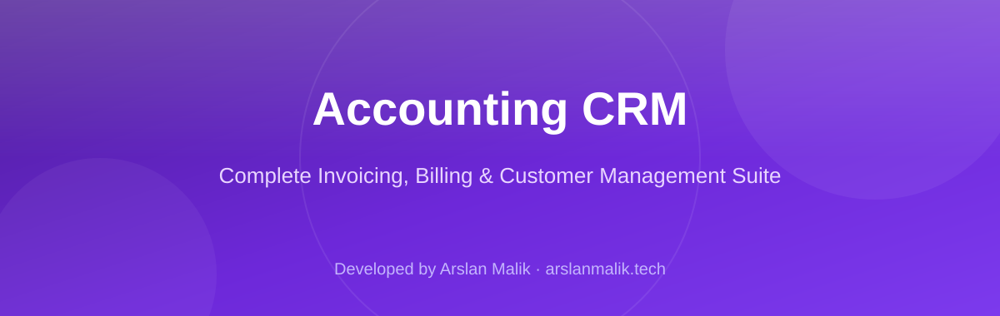
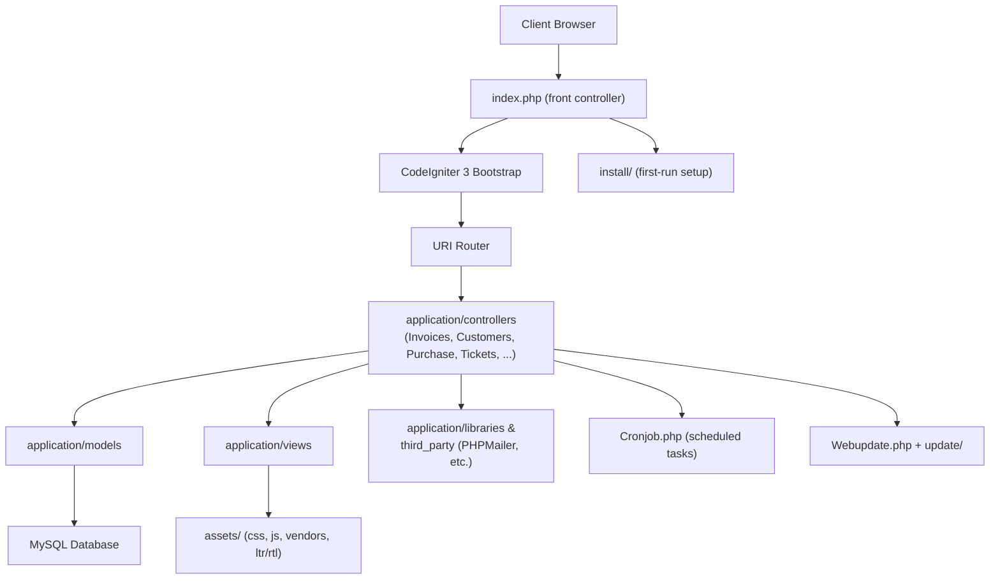

<p align="center">
  
</p>

<p align="center">
  
  
  
  
</p>

> **Developed by [Arslan Malik](https://github.com/arsalanmaalik461)**
> 📱 WhatsApp: [+92 300 8987448](https://wa.me/923008987448) · 🌐 Website: [arslanmalik.tech](https://arslanmalik.tech)

---

## 🌟 Executive Overview

**Accounting CRM** is a full-featured, web-based accounting and customer relationship management application built on the **CodeIgniter 3** PHP framework. It brings invoicing, billing, purchasing, stock, customer management, and day-to-day business operations together in a single self-hosted dashboard — the kind of all-in-one back office that small and medium businesses run on.

The codebase is organized as a classic MVC application: the `application/controllers` directory maps one-to-one with business modules — `Invoices`, `Quote`, `Purchase`, `Products`, `Customers`, `Supplier`, `Accounts`, `Transactions`, `Tickets`, `Projects`, `Employee`, `Reports` and more. It ships with a built-in installer (`install/`), an in-app web updater (`update/` + `Webupdate.php`), import/export tooling for moving data in and out, a REST API surface (`Rest.php`, `Restapi.php`), payment-gateway hooks (`Paymentgateways.php`), SMS and email notification modules, and both RTL and LTR asset bundles for right-to-left language support.

This repository holds the application at **version 8.0 (build 80)**. If you need a self-hosted billing + CRM suite you can deploy on any standard LAMP/LEMP shared hosting, this is a working, production-shaped starting point: upload the files, run the installer, configure the database, and you are billing within minutes.

---

## 📑 Table of Contents

- [✨ Key Features & Highlights](#-key-features--highlights)
- [🖥️ Feature Showcase](#️-feature-showcase)
- [🏗️ System Architecture](#️-system-architecture)
- [🚀 Quickstart & Installation Guide](#-quickstart--installation-guide)
- [📂 Project Structure](#-project-structure)
- [🛡️ Security & Notes](#️-security--notes)

---

## ✨ Key Features & Highlights

| Feature | Description |
| :--- | :--- |
| 🧾 Invoicing | Create, email (`Emailinvoice.php`), and manage invoices (`Invoices.php`), including recurring billing via `Rec_invoices.php`. |
| 💰 Quotes / Estimates | Send quotations to prospects (`Quote.php`) and convert them into invoices. |
| 🛒 Purchase Management | Record supplier purchases (`Purchase.php`) and handle stock returns (`Stockreturn.php`). |
| 📦 Products & Categories | Product catalog with categories (`Products.php`, `Productcategory.php`) and product search (`Search_products.php`). |
| 👥 Customers & Suppliers | Full customer (`Customers.php`) and supplier (`Supplier.php`) records, plus client grouping (`Clientgroup.php`). |
| 🧮 Accounts & Transactions | Chart of accounts (`Accounts.php`) with a transaction ledger (`Transactions.php`) for double-entry style tracking. |
| 🎫 Support Tickets | Built-in ticketing module (`Tickets.php`) for handling customer requests. |
| 📁 Projects & Events | Project tracking (`Projects.php`) and an event/calendar module (`Events.php`). |
| 👔 Employee Management | Employee records module (`Employee.php`) for team administration. |
| 📊 Reports, Export & Import | Reporting dashboard (`Reports.php`), CSV/data export (`Export.php`) and import (`Import.php`). |
| 💳 Payment Gateways | Gateway integration hooks (`Paymentgateways.php`) with gateway branding assets in `assets/gateway_logo/`. |
| 📲 SMS & Email Notifications | Dedicated SMS (`Sms.php`, `Sms_custom.php`) and email communication modules (`Communication.php`, `Messages.php`). |
| 🔌 REST API | Programmatic access surface via `Rest.php` and `Restapi.php`. |
| 🔧 Plugins & Templates | Extensible via `Plugins.php`; invoice/document layouts customizable through `Templates.php`. |
| 🗓️ Cron Jobs | Scheduled background tasks (`Cronjob.php`) for recurring invoices, reminders, and maintenance. |
| 🌍 RTL & Multi-language | `ltr/` and `rtl/` asset bundles plus a `language/` directory for right-to-left language support. |
| 🛠️ Built-in Installer & Updater | Guided setup in `install/` and one-click web updates via `update/` and `Webupdate.php`. |

---

## 🖥️ Feature Showcase

### 1. Billing & Invoicing Engine

> "Invoice, quote, and get paid — all from one panel."

- Standard and recurring invoices (`Invoices.php`, `Rec_invoices.php`)
- Quotations with conversion flow (`Quote.php`)
- Invoices can be emailed directly to customers (`Emailinvoice.php`)
- Custom invoice/document templates (`Templates.php`)

### 2. Inventory & Purchasing

> "Track what you buy, what you sell, and what comes back."

- Purchase order recording (`Purchase.php`)
- Product catalog with categories and search (`Products.php`, `Productcategory.php`, `Search_products.php`)
- Stock returns processing (`Stockreturn.php`)

### 3. Customer Relationship Management

> "Every customer, supplier, and ticket in one place."

- Customer and supplier master records (`Customers.php`, `Supplier.php`)
- Client grouping for segmentation (`Clientgroup.php`)
- Support ticket management (`Tickets.php`)
- SMS, custom SMS, and messaging center (`Sms.php`, `Sms_custom.php`, `Messages.php`, `Communication.php`)
- Projects and event calendar (`Projects.php`, `Events.php`)
- Employee records (`Employee.php`)

### 4. Finance & Reporting

> "Know where every rupee stands."

- Chart of accounts (`Accounts.php`) and transaction ledger (`Transactions.php`)
- Reports module (`Reports.php`) with export (`Export.php`) and import (`Import.php`) utilities
- Manager and dashboard overviews (`Manager.php`, `Dashboard.php`)

### 5. Platform & Extensibility

> "Built to run itself — and to be extended."

- Guided installer (`install/`) and web-based updater (`update/`, `Webupdate.php`)
- REST API for integrations (`Rest.php`, `Restapi.php`)
- Payment gateway hooks with logo assets (`Paymentgateways.php`, `assets/gateway_logo/`)
- Plugin system (`Plugins.php`) and admin tools (`Tools.php`, `Settings.php`, `User.php`)

---

## 🏗️ System Architecture



---

## 🚀 Quickstart & Installation Guide

### Prerequisites

- **PHP** 7.x / 8.x with `mysqli`, `mbstring`, `curl`, and `gd` extensions
- **MySQL / MariaDB** 5.7+
- **Apache** (an `.htaccess` is included) or Nginx with URL rewriting
- Composer is **not** required — third-party libraries are bundled under `application/third_party/`

### Step-by-Step Installation

```bash
# 1. Upload the repository contents to your web root (public_html or similar)
# 2. Create a MySQL database and user, e.g.:
mysql -u root -p -e "CREATE DATABASE accounting_crm CHARACTER SET utf8mb4;"

# 3. Point your browser at the installer:
#    https://your-domain.com/install
#    Follow the on-screen steps: database credentials, admin account, settings.

# 4. (Recommended) Delete or restrict access to the install/ directory afterwards.

# 5. Set up a cron job for recurring invoices and reminders:
* * * * * /usr/bin/php /path/to/public_html/index.php cronjob
```

### Post-install Checklist

1. Log in with the admin account created during installation.
2. Configure company profile, invoice templates, and currency under **Settings**.
3. Add payment gateway credentials under **Payment Gateways** (`assets/gateway_logo/` shows supported marks).
4. Import existing customers/products via **Import**, or start entering data manually.
5. Enable the cron entry above so recurring invoices and scheduled tasks run on time.

---

## 📂 Project Structure

```
accounting-Crm/
├── index.php                  # CodeIgniter front controller (entry point)
├── .htaccess                  # Apache rewrite rules
├── robots.txt                 # Crawler rules
├── version.json               # App version (8.0, build 80)
├── application/               # CodeIgniter 3 application layer
│   ├── controllers/           # One controller per module (Invoices, Customers,
│   │                          #   Purchase, Tickets, Reports, Restapi, ...)
│   ├── models/                # Database interaction layer
│   ├── views/                 # HTML templates / UI
│   ├── config/                # App configuration (DB, routes, autoload)
│   ├── core/                  # Base controller / framework extensions
│   ├── helpers/               # Reusable helper functions
│   ├── libraries/             # Custom libraries
│   ├── third_party/           # Bundled vendors (PHPMailer, etc.)
│   ├── language/              # Translation files
│   ├── migrations/            # DB schema migrations
│   ├── cache/                 # Framework cache
│   └── logs/                  # Application logs
├── system/                    # CodeIgniter 3 framework core (do not edit)
├── assets/                    # Public web assets
│   ├── css/  js/  fonts/      # Styles, scripts, webfonts
│   ├── vendors/               # Front-end vendor libraries
│   ├── ltr/  rtl/             # Left-to-right / right-to-left bundles
│   ├── gateway_logo/          # Payment gateway branding images
│   ├── img/  images/          # Images
│   └── myjs/  custom/         # Custom JavaScript
├── crm/                       # Secondary CRM instance/copy (application + system)
├── install/                   # Guided web installer
├── update/                    # Update packages
├── userfiles/                 # User uploads (keep out of version control in prod)
└── docs/
    └── assets/
        └── banner.svg         # Project banner (README artwork)
```

> **Note:** the repository contains a second CodeIgniter tree under `crm/` — treat `index.php` at the root as the primary entry point unless you are deploying the `crm/` copy separately.

---

## 🛡️ Security & Notes

- **Delete or lock down `install/` after setup** — leaving the installer reachable lets anyone re-run setup against your database.
- **Protect `application/` and `system/`** — on shared hosting, these should not be directly web-accessible; the included `.htaccess` helps, but verify on your server.
- **Never commit `application/config/database.php`** (or any file with live credentials) to a public repo; keep secrets in environment configuration instead.
- **Keep PHP and the bundled third-party libraries updated** — vendored packages (e.g. PHPMailer under `application/third_party/`) should be patched when upstream advisories land.
- **Sanitize uploads** — `userfiles/` is user-writable; validate file types and serve uploads with safe headers.
- **Use HTTPS in production** — invoices and customer data are sensitive; force TLS and set `cookie_secure` where applicable.
- **Back up the database regularly** — especially before running the web updater (`update/` + `Webupdate.php`).
- CodeIgniter 3 is a mature, stable framework; if you extend this app, follow its MVC conventions (controllers thin, logic in models, output escaped in views).

---

<p align="center">
  <sub>Developed with ❤️ by <a href="https://github.com/arsalanmaalik461">Arslan Malik</a> · 📱 <a href="https://wa.me/923008987448">WhatsApp: +92 300 8987448</a> · 🌐 <a href="https://arslanmalik.tech">arslanmalik.tech</a></sub>
</p>
